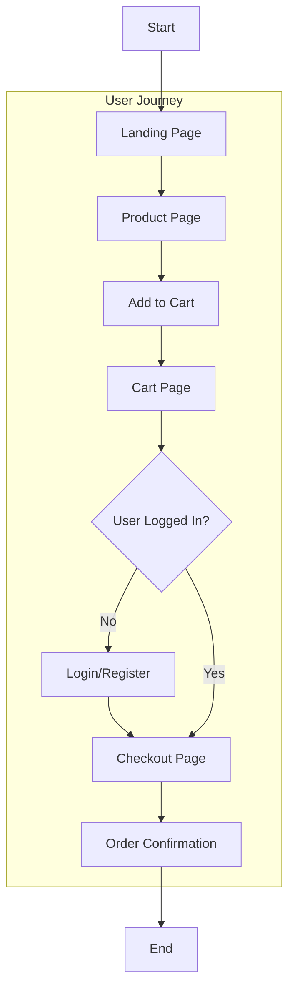

# ShopExpress - Modern E-commerce Platform


ShopExpress is a modern, responsive e-commerce platform built with HTML, CSS, and JavaScript. It provides a seamless shopping experience with features like product browsing, cart management, user authentication, and secure checkout.

## 🌟 Features

- **User Authentication**
  - Secure login and registration system
  - User profile management
  - Session handling

- **Product Management**
  - Product catalog with categories
  - Detailed product pages
  - Search functionality
  - Product filtering

- **Shopping Cart**
  - Add/remove products
  - Quantity adjustment
  - Real-time price calculation
  - Persistent cart storage

- **Checkout Process**
  - Secure payment integration
  - Order summary
  - Shipping information
  - Order confirmation

- **Admin Dashboard**
  - Product management
  - Order tracking
  - User management
  - Analytics

## 🚀 Getting Started

### Prerequisites

- Modern web browser (Chrome, Firefox, Safari, Edge)
- Git (for version control)
- Cloudflare account (for deployment)

### Installation

1. Clone the repository:
   ```bash
   git clone https://github.com/vishalG197/shopexpress_clone.git
   ```

2. Navigate to the project directory:
   ```bash
   cd shopexpress-clone
   ```

3. Open `index.html` in your browser to start the application.

## 📊 User Flow Diagram



## 🖼️ Screenshots

### Landing Page


### Product Page


### Cart Page


### Sign In and Login Page


### Admin Page


## 🛠️ Project Structure

```
shopexpress-clone/
├── index.html          # Main entry point
├── index.css           # Main stylesheet
├── index.js            # Main JavaScript file
├── product.html        # Product page
├── product.css         # Product page styles
├── Usercart.html       # Shopping cart page
├── signin.html         # Login page
├── Register.html       # Registration page
├── Userchekout.html    # Checkout page
├── Data.json           # Product data
├── images/             # Image assets
├── cart/               # Cart functionality
└── User/               # User-related functionality
```

## 🔄 E-commerce Flow

1. **Landing Page**
   - Browse featured products
   - Use search functionality
   - Navigate to product categories

2. **Product Page**
   - View product details
   - Add products to cart
   - View related products

3. **Cart Management**
   - Review selected items
   - Adjust quantities
   - Remove items
   - Proceed to checkout

4. **Authentication**
   - New users: Register
   - Existing users: Login
   - Guest checkout option

5. **Checkout Process**
   - Review order
   - Enter shipping details
   - Select payment method
   - Confirm order

6. **Order Confirmation**
   - View order summary
   - Receive order number
   - Track order status

## 🌐 Deployment

The application is deployed on Cloudflare Pages. To deploy your own version:

1. Create a Cloudflare account
2. Go to Cloudflare Pages
3. Create a new project
4. Connect your GitHub repository
5. Configure build settings:
   - Build command: (leave empty)
   - Build output directory: (leave empty)
6. Deploy!

## 🔧 Configuration

- Update `Data.json` to modify product information
- Customize colors and styles in CSS files
- Configure payment gateway settings in checkout page

## 🤝 Contributing

Contributions are welcome! Please feel free to submit a Pull Request.

## 📝 License

This project is licensed under the MIT License - see the LICENSE file for details.

## 👥 Authors

- Vishal Gupta - Initial work

## 🙏 Acknowledgments

- Font Awesome for icons
- Cloudflare for hosting
- All contributors and supporters

---

Made with ❤️ by Vishal Gupta

# ShopExpress

-----
### E-COMMERCE WEBSITE FOR GROCERIES PRODUCTS* 

Project: Make a clone of the shopclue.com.

Cloned-Website: https://marvelous-crostata-edb007.netlify.app/index.html

HOW TO GO THROUGH THE PROJECT -
- First, visit the link that shows you the landing page.
- click on see more, on clicking that it redirects to the product page
- add the product to the card and go to the card page. click on the buy now
- you have to register and login after that click on the buy now, and it redirects you to the checkout page
- 


## Landing Page


## Product Page


## cart page


## Sing in and log in Page


## Admin Page


This E-Commerce website specializes in selling grocery products for kitchens & gadgets. The website provides 16,000 products of different products.

In this project, we used HTML, CSS, and javascript With the self-learning efforts and the technology stack, that we have learned till Unit-2 in the Masai School, we could clone the whole website with the same looks & features.

This is an Individual project built within 5 days. 

# Technology Stack Used 🌟
* HTML
* CSS
* JavaScript
* local storage

For storing user data we also used JSON-Server & local storage.

## How to run the Project
* Clone this repo and run it using the live server.

## End Notes 📑
In this project, we have tried to achieve a near-to-perfect clone of the original website  as much as possible. This entire journey of this construct week has given us experiences and we have learned lots of things by applying to the actual website and it gave us a lot of confidence. Most of the features are added and the website's functionality is achieved.
